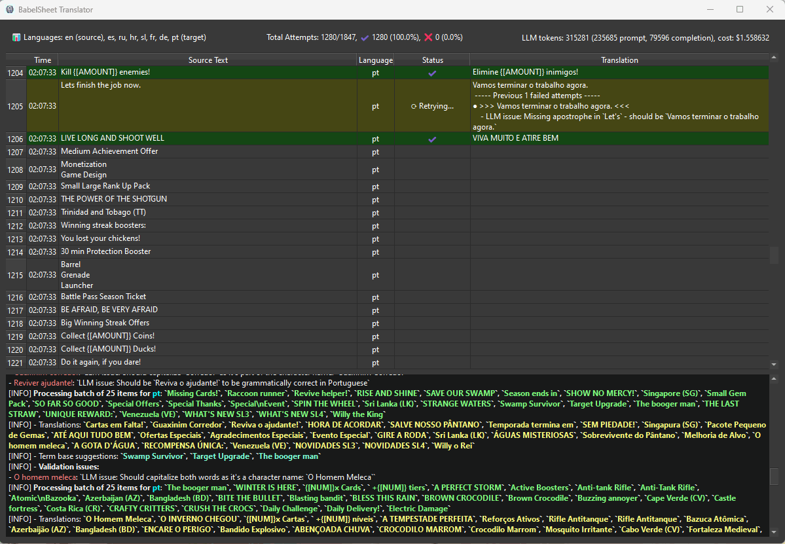

# BabelSheet



BabelSheet is an automated translation tool that leverages AI to deliver high-quality translations with comprehensive validation.

 - It translates texts from Google Sheets with their full context, builds an intelligent term base from existing translations, and automatically uploads the translations back to your sheets.
 - The multi-stage validation process combines local checks for technical accuracy (punctuation, capitalization, etc.) with AI-powered semantic validation that ensures translations maintain proper context and terminology.
 - Failed translations automatically re-enter the translation pipeline until they meet quality standards, creating a robust feedback loop that consistently produces superior translations.

## Features

- Seamless Google Sheets Integration
  - Direct read/write access to your spreadsheets
  - Automated column management
  - Real-time updates
  - Batch processing with configurable size
- Advanced Translation Capabilities
  - AI-powered translations with context awareness
  - Support for multiple LLM providers via LiteLLM:
    - Anthropic
    - OpenAI
    - Google Gemini
    - Mistral AI
    - Cohere
    - Local models (via LM Studio or Ollama)
  - Intelligent context handling
  - Translation memory and dictionary
- Quality Control
  - Automated term base management
  - Quality assurance checks
  - Parallel validation processing
  - Non-translatable terms protection
  - Automatic validation retries
  - Detailed error logging
- Efficient Processing
  - Smart batching system
  - Automatic retry mechanism
  - Parallel processing
  - Error resilience
- Automatic Dictionary and Term Base Creation
  - Automatically create a dictionary from all available translations
  - Automatically handle duplicates - it doesn't translate the same text twice
  - Dictionary is used as a term base for improving consistency of further translations
  - If configured, it will also automatically update the Term Base with new LLM suggestions
  - If configured, it will allow Translation LLM to override validation if it detects false positives
  - Translation caching


## Installation

1. Clone the repository:
```bash
git clone https://github.com/yourusername/babelsheet.git
cd babelsheet
```

2. Create and activate a virtual environment:

On Windows:
```bash
python -m venv venv
.\venv\Scripts\activate
```

On Unix/MacOS:
```bash
python -m venv venv
source venv/bin/activate
```

3. Install the package in development mode:
```bash
pip install -e .
```

## Sheet Structure

### Translation Sheets
- Each sheet we want to translate should have these columns:
  - Source language column (e.g., 'en' for English)
  - Target language columns (e.g., 'es' for Spanish, 'fr' for French, etc.)
  - Optional context columns, which will be used to improve translations (matched by patterns in config)
  - Language columns can be named anything which LLM could understand, e.g. "en" or "english" or "english_US" should work. But they have to appear in the sheet exactly as they are named in configuration.


## Token Usage and Cost Metrics (for reference, your mileage may vary)

Translating and validating 1000 rows of text for an app would use approximately 270,000 prompt tokens and 85,000 completion tokens.
These metrics can vary based on text length and complexity, and how many iterations are needed to get the translation right.


## Configuration

1. Create a Google Cloud project and enable the Google Sheets API:
   - Go to [Google Cloud Console](https://console.cloud.google.com)
   - Create a new project or select existing one
   - Enable Google Sheets API and Google Drive API
   - Create OAuth 2.0 credentials
   - Download the credentials file

2. Set up the configuration:
```bash
# Create config directory
mkdir -p config

# Copy and rename credentials file
cp path/to/downloaded/credentials.json config/credentials.json

# Copy and customize config file
cp config/config.yaml.example config/config.yaml
```

3. Edit config/config.yaml to match your needs:
```yaml
google_sheets:
  credentials_file: "credentials.json"
  token_file: "token.pickle"
  spreadsheet_id: "your-sheet-id"  # Optional if provided via CLI
  scopes:
    - "https://www.googleapis.com/auth/spreadsheets"
    - "https://www.googleapis.com/auth/drive.readonly"

languages:
  source: "en"                # Source language code
  target: ["es", "fr", "de"]  # Default target languages if not specified via CLI
  
llm:
  api_key: ""       # Your API key for the LLM provider, if needed
  model: "anthropic/claude-3-5-sonnet-20241022"    # The LLM model to use (e.g., "gpt-4", "claude-3-5-sonnet-20241022")
  batch_size: 25    # Number of rows to process in a batch

  additional_llm_context: "Additional context and instructions for the LLM, like app name and description, company name, etc."

  temperature: 0.2  # Controls randomness in responses
  max_retries: 5    # Maximum retry attempts
  retry_delay: 1    # Initial delay between retries

qa:
  max_length: 4000  # Maximum translated text length
  use_override: false # Translation LLM can override previously failed validation. Sometimes this can fix some issues, but sometimes it can make it worse. (default: false)
  capitalization_check: true  # Check for capitalization mismatch between source and translation
  newline_check: true  # Check for newline count mismatch between source and translation
  ending_punctuation_check: true  # Check for ending punctuation mismatch between source and translation
  remove_html_tags_before_validation: true  # Remove HTML tags before validation
  non_translatable_patterns:
    - start: "{["   # Matches {[TERM]}
      end: "]}"
    - start: "<"    # Matches <TERM>
      end: ">"

context_columns:    # Columns which will be used to improve translations
  patterns:
    - "comment"     # Will match: comment, comments, commented, etc.
    - "desc"        # Will match: desc, description, descriptions, etc.
    - "context"     # Will match: context, contextual, etc.
    - "note"        # Will match: note, notes, subnote, notation, etc.
    - "info"        # Will match: info, information, etc.
    - "how"         # Will match: how, howto, howto, etc.
    - "additional"  # Will match: additional, etc.
  ignore_case: true  # Will match column names regardless of case

term_base:
  add_terms_to_term_base: false  # Add suggested terms to term base
  #sheet_name: "term_base"  # Name of the sheet containing term base
  sheet_name: "[E] Term Base"  # Name of the sheet containing term base

ui:
  type: graphical  # Use graphical output mode

output:
  dir: "translation_logs"  # Directory for storing translation logs and reports
    term: "EN TERM"
    comment: "COMMENT"
    translation_prefix: "TRANSLATION_"
```

Place the downloaded credentials.json file in the config directory.

## Usage

### Basic Translation

1. Initialize the tool (first time only):
```bash
python -m babelsheet init
```

2. Start translation:
```bash
python -m babelsheet translate -t "es,fr,de" -s "your-sheet-id"
```

Options:
- `-t, --target-langs`: Comma-separated list of target languages
- `-s, --sheet-id`: Google Sheet ID (optional if in config)
- `-v, --verbose`: Increase verbosity (-v for info, -vv for debug)
- `-so, --simple-output`: Use simple console output instead of UI

### Translation Process

1. **Initialization**
   - Tool connects to Google Sheets
   - Loads term base and configuration
   - Initializes LLM connection

2. **Analysis**
   - Scans sheets for missing translations
   - Groups translations by language
   - Orders by text length for optimal term base usage

3. **Translation**
   - Processes translations in batches
   - Applies term base for consistency
   - Validates translations in real-time
   - Handles retries automatically

4. **Quality Control**
   - Validates format and syntax
   - Checks term consistency
   - Verifies non-translatable terms
   - Provides detailed error reporting

5. **Completion**
   - Updates sheets with translations
   - Generates statistics
   - Creates detailed logs
   - Updates term base if configured

### Best Practices

1. **Term Base Management**
   - Keep term base updated
   - Add context to terms
   - Review suggested terms
   - Use override carefully

2. **Translation Quality**
   - Use recommended LLM providers
   - Set appropriate batch sizes
   - Monitor validation results
   - Review logs regularly

3. **Performance**
   - Adjust batch size based on needs
   - Use parallel processing
   - Enable caching
   - Monitor resource usage

## LLM Compatibility

BabelSheet uses LiteLLM to support various LLM providers. Configure your provider in `config.yaml`:
Check [LiteLLM](https://docs.litellm.ai/docs/providers) for supported providers.

### Local LLMs

NOTE: Local LLMs are not recommended for production use, as they may not match the quality of top-tier cloud LLMs.

1. **LM Studio**:
```yaml
llm:
  api_key: "not-needed"
  model: "lm_studio/model-name"   # The model name doesn't matter, it's selected in LM Studio
```

2. **Ollama**:
```yaml
llm:
  api_key: "not-needed"
  model: "ollama/mistral"  # or ollama/llama2, ollama/codellama, etc.
```

### Cloud Services

1. **Anthropic Claude**:
```yaml
llm:
  api_key: "your-anthropic-key"
  model: "anthropic/claude-3-5-sonnet-20241022"   # The LLM model to use (e.g., "gpt-4", "claude-3-5-sonnet-20241022")
```

2. **OpenAI**:
```yaml
llm:
  api_key: "your-openai-key"
  model: "openai/gpt-4-turbo-preview"  # or openai/gpt-4, openai/gpt-3.5-turbo
```

3. **Azure OpenAI**:
```yaml
llm:
  api_key: "your-azure-key"
  model: "azure/deployment-name/model-name"  # e.g., azure/gpt4/gpt-4
```

4. **Google Gemini**:
```yaml
llm:
  api_key: "your-google-key"
  model: "gemini/gemini-pro"
```

5. **Mistral**:
```yaml
llm:
  api_key: "your-mistral-key"
  model: "mistral/mistral-large-latest"  # or mistral/mistral-medium, mistral/mistral-small
```

6. **Cohere**:
```yaml
llm:
  api_key: "your-cohere-key"
  model: "cohere/command"  # or cohere/command-light
```

### Set your LLM API key:

On Windows (PowerShell):
```powershell
$env:LLM_API_KEY="your-api-key"
```

On Unix/MacOS:
```bash
export LLM_API_KEY=your-api-key
```

### Model Selection Tips

1. For best translation quality, we recommend:
   - Anthropic Claude 3.5 Sonnet
   - OpenAI GPT-4 Turbo
   - Mistral Large
   - Google Gemini Pro

2. For offline/private deployments:
   - Azure OpenAI (enterprise)
   - Local models via LM Studio or Ollama

## Usage

1. Prepare your Google Sheet:
   - Create sheets for translation
   - Add a 'term_base' sheet with columns: EN TERM, COMMENT, TRANSLATION_XX
   - Make sure you have 'key', 'en', and target language columns

2. Initialize the tool:
```bash
python -m babelsheet init
```

3. Translate missing texts:
```bash
# Basic translation
python -m babelsheet translate --sheet-id="your-sheet-id" --target-langs="es,fr,de"

# With batch processing options
python -m babelsheet translate \
    --sheet-id="your-sheet-id" \
    --target-langs="es,fr,de" \
    --force  # Add missing columns without confirmation

# Preview changes
python -m babelsheet translate --sheet-id="your-sheet-id" --target-langs="es" --dry-run

# Translate with specific batch size
# Edit config.yaml to set batch_size: 3
python -m babelsheet translate --sheet-id="your-sheet-id" --target-langs="es,fr,de"
```

### CLI Options
- `--sheet-id`: Google Sheet ID to process
- `--target-langs`: Comma-separated list of target languages
- `--dry-run`: Show what would be done without making changes

## Sheet Structure

### Translation Sheets
- Each sheet should have these columns:
  - A key column (usually 'key' or 'id')
  - Source language column (e.g., 'en' for English)
  - Target language columns (e.g., 'es' for Spanish)
  - Optional context columns (matched by patterns in config)

### Term Base Sheet
- Must contain these columns:
  - EN TERM: The English term
  - COMMENT: Context or usage notes
  - TRANSLATION_XX: Translation columns (e.g., TRANSLATION_ES for Spanish)

## Batch Processing

The application supports batch processing of translations to optimize API usage and performance. For best translation quality, we recommend:
- Batch size: 5-20 rows (default: 10)
- Configure in config.yaml:
```yaml
llm:
  batch_size: 10    # Recommended range: 5-20
  batch_delay: 1    # Delay between batches in seconds
```


2. **Batch Flow**:
   - Texts are grouped into batches
   - Each batch is translated together
   - Translations are validated in parallel
   - Results are written to Google Sheets immediately
   - Process continues with next batch

3. **Benefits**:
   - Efficient resource usage
   - Immediate feedback
   - Progress visibility
   - Error resilience

## Quality Assurance

The tool automatically checks:
- Format consistency
- Markup preservation ([],{})
- Term base compliance
- Character limits
- Newline handling
- Cultural appropriateness
- Translation accuracy

## Error Handling

- Authentication errors will prompt for re-authentication
- Translation failures are retried with exponential backoff
- Batch failures don't affect other batches
- QA issues trigger retranslation
- All errors are logged for review

## Troubleshooting

### Common Issues

1. **Authentication Errors**
   - Verify credentials.json is in config directory
   - Check API key environment variable
   - Ensure correct permissions in Google Cloud Console
   - Delete token.pickle to force re-authentication

2. **Translation Failures**
   - Check error logs in translation_logs directory
   - Verify term base format
   - Ensure non-translatable terms are properly marked
   - Try reducing batch size
   - Check LLM API status

3. **Performance Issues**
   - Adjust batch size in config
   - Check network connectivity
   - Monitor system resources
   - Consider using a faster LLM provider

4. **UI Issues**
   - Try simple output mode (-so flag)
   - Check terminal compatibility
   - Verify Python version (3.8+ required)
   - Update dependencies

### Error Messages

1. **"Invalid JSON response from LLM"**
   - LLM response format issue
   - Try different model or provider
   - Check for rate limiting
   - Verify API key permissions

2. **"Failed to find translation item"**
   - Sheet structure mismatch
   - Missing required columns
   - Check sheet permissions
   - Verify sheet ID

3. **"Max retries reached"**
   - Network connectivity issues
   - LLM service unavailable
   - Rate limiting
   - Invalid translations

4. **"Number of translations does not match"**
   - LLM response parsing error
   - Try different model
   - Check batch size
   - Verify source text format

## Development

### Running Tests

1. Unit Tests:
```bash
pytest babelsheet/tests/
```

2. Integration Tests:
To run integration tests, you need:
- A test Google Sheet with appropriate permissions
- Valid credentials.json
- LLM API key

```bash
# Set up test environment
export TEST_SHEET_ID="your-test-sheet-id"
export LLM_API_KEY="your-api-key"

# Run integration tests
pytest babelsheet/tests/ --integration
```

Note: Integration tests will modify the test sheet. Use a dedicated test sheet, not a production one.

## Contributing

1. Fork the repository
2. Create your feature branch
3. Commit your changes
4. Push to the branch
5. Create a Pull Request

## License

This project is licensed under the MIT License - see the LICENSE file for details.

## Acknowledgments

- Cursor AI and Claude 3.5 Sonnet for code generation
- LiteLLM for LLM integration
